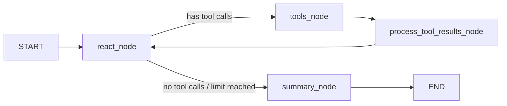

# Cybersecurity AI Agent — Architecture Overview

## 🎯 Purpose

A **LangGraph-based AI agent** that autonomously scans a target web application/REST API for vulnerabilities, attempts attacks, and generates a report. Built as a learning project for LangGraph with real-world applicability.

---

## 🛠 Tech Stack

| Layer | Technology |
|---|---|
| **Language** | Python 3.13+ |
| **AI Orchestration** | [LangGraph](https://github.com/langchain-ai/langgraph) `>=0.4.8` |
| **LLM** | OpenAI `gpt-4.1-2025-04-14` via `langchain-openai` |
| **Data Models** | Pydantic v2 (`BaseModel`) |
| **Web Framework** | FastAPI + Uvicorn (for the `api_target` mock server) |
| **External Search** | Tavily Python client |
| **Package Manager** | Poetry |
| **Testing** | pytest + pytest-asyncio |
| **Linting** | ruff, black, isort |

---

## 📁 Project Structure

```
cybersecurity-ai-agent/
├── src/
│   ├── agent_core/          # Shared base classes (reusable across agents)
│   │   ├── node/            # Base node classes (ReActNode, ProcessToolResultsNode)
│   │   ├── state/           # Base state (ReActAgentState, Target, ToolsUsage)
│   │   ├── edge/            # Shared conditional edges (ToolRouterEdge)
│   │   └── tool/            # Shared tools (curl, ffuf)
│   │
│   ├── scan_agent/          # Scans the target for exposed endpoints/vulnerabilities
│   │   ├── graph.py         # LangGraph graph definition
│   │   ├── node/            # ScanNode, SummaryNode
│   │   └── state/           # ScanAgentState
│   │
│   ├── attack_agent/        # Actively probes/attacks found endpoints
│   │   ├── graph.py
│   │   ├── node/            # AttackNode, AttackSummaryNode
│   │   └── state/           # AttackAgentState
│   │
│   ├── cybersecurity_agent/ # Top-level orchestrator that chains scan → attack → summary
│   │   ├── graph.py
│   │   ├── node/            # ScanAgentNode, AttackAgentNode, CybersecuritySummaryNode
│   │   └── state/           # CybersecurityAgentState
│   │
│   ├── api_target/          # Mock FastAPI app used as a scan/attack target
│   └── target_scan_agent/   # ⚠️ Outdated first iteration (ignore)
│
├── tests/                   # pytest tests
├── notebooks/               # Jupyter notebooks for exploration
├── docs/                    # Architecture diagrams (PNGs)
├── wordlists/               # Directory wordlists for ffuf fuzzing
├── pyproject.toml
└── CLAUDE.md                # AI coding rules for this repo
```

---

## 🏗 Architecture

### Agent Patterns Used
- **ReAct** (Reason + Act): The core loop each sub-agent runs — the LLM reasons and calls tools iteratively.
- **Mixture of Experts**: The top-level graph routes work to specialized sub-agents (scan, attack).

### Top-Level Orchestrator Flow


The **`cybersecurity_agent/graph.py`** is the entry point. It wires three wrapper nodes:
1. `ScanAgentNode` — runs the scan sub-graph
2. `AttackAgentNode` — runs the attack sub-graph
3. `CybersecuritySummaryNode` — synthesizes a final report via LLM

---

### Sub-Agent Graph Pattern (Scan & Attack)

Both `scan_agent` and `attack_agent` follow the **same internal ReAct loop pattern**:



| Component | Role |
|---|---|
| `ReActNode` (base class) | Sends state + system prompt to LLM, returns tool calls or final answer |
| `ToolNode` (LangGraph prebuilt) | Executes the tool calls in parallel |
| `ProcessToolResultsNode` | Post-processes raw tool results and updates state |
| `ToolRouterEdge` | Conditional edge: routes to tools vs summary based on LLM output |
| `SummaryNode / AttackSummaryNode` | Final LLM call to synthesize structured output |

---

### Tools Available

| Tool | Used By | Purpose |
|---|---|---|
| `curl_tool` | scan + attack | Makes HTTP requests to the target |
| `ffuf_directory_scan` | scan only | Directory/path fuzzing using ffuf |

---

### State Hierarchy

```
MessagesState (LangGraph)
    └── ReActAgentState          ← agent_core base
            ├── usage: ReActUsage        (tracks recursion limit)
            ├── tools_usage: ToolsUsage  (per-tool call limits)
            ├── tools: Tools             (tool metadata)
            ├── results: list[ToolResult]  (accumulated tool outputs)
            └── target: Target           (URL + config)

    ScanAgentState  ←── extends ReActAgentState
    AttackAgentState ←── extends ReActAgentState
    CybersecurityAgentState  ←── top-level, holds sub-agent results
```

State uses **Pydantic BaseModel** throughout, with `Annotated[list, operator.add]` for append-only fields like `results`.

---

### Checkpointing

Each sub-graph uses **`MemorySaver`** (in-memory checkpointer), enabling:
- State persistence across ReAct iterations within a session
- Potential for `human-in-the-loop` interruptions

---

## 🎭 `api_target` — Mock Target Server

A **FastAPI app** (`src/api_target/main.py`) that intentionally exposes common web vulnerabilities for the agents to find and exploit during testing. This removes the need to scan live public sites.

---

## 🚀 Getting Started (Startup Sequence)

### 1. Environment Setup
The project uses **Poetry** for dependency management.
```bash
poetry install
```

### 2. Required Secrets
The agents require the following environment variables:
- `OPENAI_API_KEY`: For the GPT-4 brain.
- `TAVILY_API_KEY`: For external search capabilities.

### 3. Execution Flow
1. **Compile the Graph**: Call `create_cybersecurity_graph()` from `src/cybersecurity_agent/graph.py`.
2. **Initialize State**: Provide a `Target` object with the URL to scan.
3. **Invoke**: Use `await graph.ainvoke(state, config)` to start the sequence.

### 4. Entry Points
- **Exploration**: Use `notebooks/cybersecurity_agent.ipynb`.
- **Mock Target**: Run `src/api_target/main.py` to start the FastAPI server that the agent will "attack."

---

## 📐 Key Design Principles (from `CLAUDE.md`)

- **SOLID** principles strictly followed
- All data models use Pydantic `BaseModel` with `to_dict()` → `model_dump(mode="json")`
- Node classes are **callable classes** (`__call__`), injected with dependencies via constructor
- Generic base classes use Python 3.12+ **type parameter syntax**: `class ReActNode[StateT: ReActAgentState]`
- Tools are kept separate from node logic
- Usage limits are enforced at the state level to prevent infinite loops
